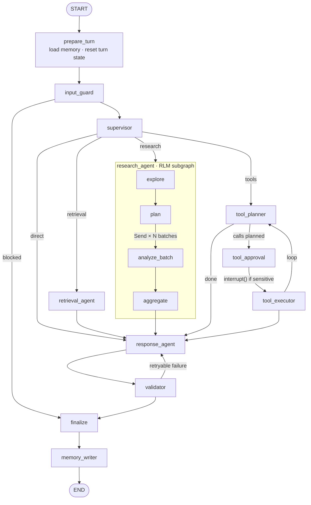
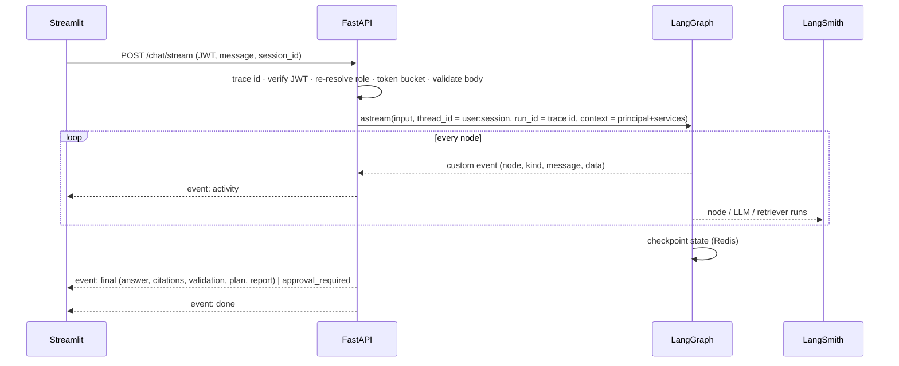

# Architecture

This document explains how the Enterprise AI Assistant is built and why. Decisions with real
alternatives are recorded as ADRs in [`docs/ADR/`](ADR/). Assumptions and shortcuts are in
[`ASSUMPTIONS.md`](ASSUMPTIONS.md).

## 1. System context

```mermaid
flowchart LR
  user([Bank employee]) --> ui["Streamlit UI<br/>chat + Agent Activity Panel"]
  ui -- "JWT · Server-Sent Events" --> api["FastAPI workers<br/>(stateless, N replicas)"]
  api <--> redis[("Redis<br/>checkpoints · long-term memory<br/>rate limits · audit log")]
  api --> graph["LangGraph agent"]
  graph --> retriever["Hybrid retriever"]
  retriever --> pinecone[("Pinecone<br/>dense index + sparse (BM25) index<br/>namespaces = departments")]
  retriever --> inference["Pinecone Inference<br/>e5 embeddings · bge reranker"]
  graph --> llm["LLM gateway<br/>Claude Sonnet 5 / Haiku 4.5<br/>retry · fallback · semaphore"]
  graph --> tools["Tool registry<br/>RBAC re-check · audit"]
  tools --> mcp["MCP operations server<br/>(internal network)"]
  tools --> sandbox["Python sandbox<br/>(isolated child process)"]
  graph -. "every node, LLM call,<br/>retrieval, RLM slice" .-> langsmith["LangSmith"]
  ingest["data/ingest.py<br/>offline batch job"] --> pinecone
```

| Component | Code | Responsibility |
|---|---|---|
| UI | `frontend/streamlit_app.py` | Login, chat, live activity panel, approvals, citations. No authorization logic. |
| API | `backend/app/main.py`, `app/api/` | Auth, RBAC, rate limiting, validation, SSE streaming, error envelopes. |
| Composition root | `app/container.py` | The only place that picks adapters for each port (ADR-0001). |
| Agent graph | `app/agents/` | Orchestration: supervisor, retrieval, RLM research, tools, response, validator. |
| Retrieval | `app/retrieval/` | Dense + BM25 legs, RRF fusion, reranking, access filter, catalog. |
| Tools | `app/tools/`, `backend/mcp_server/` | Knowledge search, Python analysis, MCP ops data, admin tools. |
| Guardrails | `app/guardrails/` | Injection detection, content sanitization, output checks and redaction. |
| Memory | `app/memory/` | Checkpointer (short-term) and per-user store (long-term). |
| Observability | `app/observability/`, `app/core/logging.py` | Activity events, LangSmith setup, JSON logs. |

## 2. The agent graph



**State** (`agents/state.py`) is one typed object with two lifetimes. `messages` is conversation
scope and checkpointed. Everything else is turn scope, reset by `prepare_turn`, so evidence from a
previous question can never leak into a new answer. Nodes return partial updates. Parallel
branches write through reducers (`append_or_reset`, `union_or_reset`).

**Dependencies reach nodes through `runtime.context`** (`AgentContext`): the verified
`Principal`, trace id, and worker-lifetime services. The principal is deliberately *not* in
state, because state is persisted and replayed, and authorization must come from the token on every
request, including a resume after an approval.

| Node | Decision it makes | LLM tier | Deterministic fallback |
|---|---|---|---|
| `input_guard` | block / flag / pass the request | — | — |
| `supervisor` | strategy, standalone query, filters | fast (structured output) | keyword router |
| `retrieval_agent` | single hybrid search, filter relaxation | — | — |
| `research_agent` | plan, decompose, recurse, aggregate (§3) | reasoning (plan), fast (extraction) | quarter planner, section parser |
| `tool_planner` | which tools, which args | fast (tool calling) | keyword → single tool |
| `tool_approval` | human approval via `interrupt()` | — | — |
| `tool_executor` | run allowed calls, collect evidence | — | — |
| `response_agent` | grounded synthesis with `[n]` citations | reasoning | extractive answer |
| `validator` | pass / retry / substitute | — | — |
| `memory_writer` | durable user facts to remember | fast (structured) | cue-sentence extraction |

Policy the LLM cannot override is applied after the supervisor decides:
`enforce_route_policy` downgrades `tools` for roles without tool permissions, drops unknown
departments and inverted dates.

## 3. Recursive research (RLM)

For broad questions ("summarize all payment outages last year and find recurring root causes"),
stuffing documents into context does not scale. The research subgraph follows the RLM pattern:

1. **Explore:** `catalog.overview(clearance)` returns counts by department, type and date. No text is read.
2. **Plan:** the reasoning model writes a Python plan (`PLAN = [batch(...), ...]`).
   `rlm_plan.parse_plan` interprets it through an AST whitelist and never `exec`s it (ADR-0003).
   Invalid or malicious plans fall back to a deterministic quarterly plan.
3. **Decompose:** each batch becomes a LangGraph `Send` to `analyze_batch`, so batches run in parallel.
4. **Recurse:** `analyze_slice(batch, depth)` checks the catalog. A slice with more documents than
   `RLM_MAX_DOCS_PER_SLICE` splits at its median date and calls itself on both halves, down to
   `RLM_MAX_DEPTH`. Each call is a `@traceable` run, so LangSmith shows the recursion tree.
5. **Retrieve targeted sections:** a leaf searches only its own documents (`doc_ids` filter) with a
   per-document passage quota, then a sub-agent extracts structured incident findings. Findings
   citing documents that were not retrieved are dropped (`ground_findings`).
6. **Aggregate:** plain Python deduplicates incidents, numbers the evidence and tallies root causes.
   Counting is deterministic and auditable; the LLM only writes the narrative.

Fan-out is bounded (`RLM_MAX_BATCHES × 2^RLM_MAX_DEPTH` leaves) and slice analysis shares a
worker-wide semaphore. A failing batch is reported in `failed_batches` and the rest of the
research still completes.

## 4. Retrieval pipeline

```
query ─┬─ embed (e5, "query") ─► dense index  ─┐  per namespace, concurrently (semaphore)
       └─ BM25 IDF weights    ─► sparse index ─┘
             ─► RRF fusion (per-leg ranks kept) ─► cross-encoder rerank (top 20 → 6)
             ─► clearance re-check ─► injection scan ─► attributed chunks
```

- The access filter is built only from the principal's clearance, by `build_metadata_filter`, and is
  always present (ADR-0002).
- If one leg fails, the other still answers and `degraded_legs` records it. If both fail,
  `RetrievalUnavailableError` makes the agent say so instead of guessing.
- Chunking is heading-aware. Chunk ids are `DOC-ID::section-slug::n`, stable across runs, so
  ingestion is idempotent.

## 5. Request lifecycle (streaming)



One id joins all views: the `X-Trace-Id` header, every JSON log line, every activity event, and
the LangSmith root run id.

## 6. Failure handling ("butterfly effect" containment)

| Failure | Where handled | Outcome |
|---|---|---|
| LLM error / timeout | `LLMGateway` retries with jittered backoff, then optional fallback provider | Nodes take deterministic fallbacks; `degraded` lists them in the answer |
| Invalid structured output | gateway → `LLMUnavailableError` | same as above |
| Malicious / invalid RLM plan | `parse_plan` | deterministic plan, warning event |
| One retrieval leg down | `HybridRetriever` | answer from the other leg, `degraded_legs` |
| Vector DB down | `RetrievalUnavailableError` | "knowledge base unavailable" notice, never fabricated |
| One RLM batch fails | `analyze_slice` | partial report with `failed_batches` note |
| Hallucinated citation / uncited answer | `validator` | regenerate with feedback (bounded), else extractive substitute |
| Prompt leak (canary) / clearance violation | `validator` | non-retryable; answer replaced |
| MCP server down / tool timeout | `MCPToolProvider`, `ToolRegistry` | tool error in activity panel; answer continues |
| Redis down (rate limiter) | `RedisTokenBucket` | fail open to per-replica bucket, logged |
| Client disconnects mid-stream | SSE generator cancelled | state checkpointed at last super-step |
| Unhandled exception | exception handlers | 500 envelope with trace id, no stack trace |

## 7. Scalability

- **Stateless workers.** Checkpoints, long-term memory, rate-limit buckets and audit live in Redis.
  `APP_ENV=production` refuses to start without `REDIS_URL`.
- **Async end to end.** Pinecone asyncio client, async LLM calls, `httpx`, the MCP client, and
  subprocess I/O for the sandbox. CPU-bound PBKDF2 runs in a thread.
- **Bounded concurrency.** LLM semaphore per worker, namespace fan-out semaphore, RLM slice semaphore,
  and caps on batches, depth, tool iterations and validation retries.
- **Decoupled ingestion.** `data/ingest.py` is an offline, idempotent batch job.
- **Provider abstraction.** Swapping the LLM, embeddings, reranker or vector store is configuration.

Known scale debt is tagged `# SCALE-DEBT:` in code and listed in `ASSUMPTIONS.md`.
